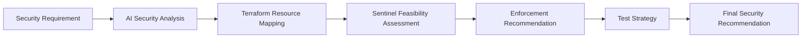

# AI Cloud Security Policy Agent

An AI-assisted cloud security feasibility agent that evaluates cloud security requirements and determines whether they can be enforced through Terraform Sentinel policy-as-code.

## Why I Built This

Cloud security teams often receive security requirements that must be translated into technical controls. Before writing policy-as-code, engineers need to determine:

- whether the requirement is technically enforceable,
- which Terraform resources and attributes are relevant,
- what enforcement level is appropriate,
- where exceptions may be required,
- and how the control should be tested.

This project demonstrates how AI can assist with that analysis while keeping the security engineer in the decision loop.

## Current Capabilities

The agent accepts a structured cloud security requirement and produces:

- Cloud provider and service identification
- Security risk analysis
- Risk level
- Terraform policy-as-code feasibility
- Relevant Terraform resources and attributes
- Recommended Sentinel enforcement level
- Exception and override considerations
- Positive, negative, and edge-case test scenarios
- Technical limitations
- A final feasibility decision:
  - Feasible
  - Partially Feasible
  - Not Feasible

## Example Use Case

### Input

```text
Cloud Provider: AWS
Service: Amazon S3
Security Domain: Data Protection

Security Requirement:
All S3 buckets storing sensitive data must prevent public access and enforce
encryption at rest. Infrastructure that does not meet these requirements
should be prevented from deployment unless an approved exception exists.

Task:
Perform a cloud security feasibility assessment and determine whether this
requirement can be enforced using Terraform Sentinel.
```

### Expected Analysis Areas

The agent evaluates:

1. Security risk
2. Terraform implementation surface
3. Sentinel feasibility
4. Enforcement recommendation
5. Exceptions
6. Testing strategy
7. Technical limitations
8. Final recommendation

## Architecture



## Planned Improvements

The current prototype relies on model knowledge for technical mapping. A key next step is grounding the agent against trusted sources to reduce incorrect or outdated Terraform recommendations.

Planned enhancements:

- RAG using HashiCorp Terraform provider documentation
- Sentinel documentation grounding
- AWS service documentation retrieval
- Structured JSON output
- Confidence scoring
- Human-review checkpoints
- Multi-cloud support for Azure and GCP
- Optional Sentinel policy skeleton generation

## Repository Structure

```text
ai-cloud-security-policy-agent/
├── README.md
├── .gitignore
├── prompts/
│   └── cloud_security_agent_prompt.md
├── examples/
│   ├── s3_security_requirement.md
│   └── s3_sample_output.md
├── docs/
│   └── architecture.md
└── screenshots/
    └── README.md
```

## Security Note

This repository uses synthetic security requirements and examples only.

Do not upload employer-owned code, internal policies, credentials, API keys,
security findings, architecture details, or proprietary cloud configurations
to a public repository.

## Skills Demonstrated

- Cloud Security Engineering
- AI Agent Design
- Prompt Engineering
- Policy-as-Code
- Terraform
- HashiCorp Sentinel
- Security Control Analysis
- Cloud Governance
- AWS Security
- Security Testing Strategy

## Status

Prototype / Portfolio Project

The current version demonstrates the core feasibility-analysis workflow. Future
iterations will add document grounding and stronger validation of Terraform
implementation details.
