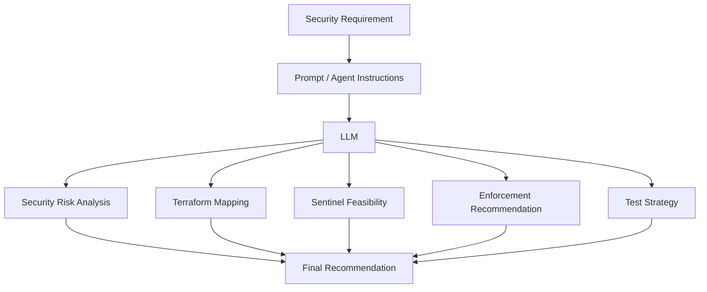
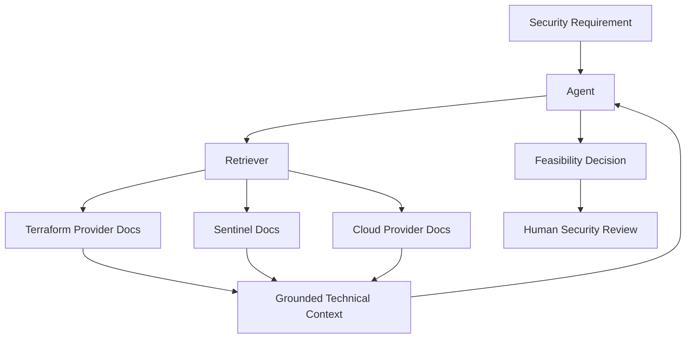

# Architecture

## Current Prototype

The current version focuses on converting a security requirement into a
structured feasibility assessment.

## Target Architecture

The next iteration should ground technical recommendations against trusted
documentation.

## Design Goal

The agent should assist the engineer rather than replace security judgment.

The preferred workflow is:

1. Receive a security requirement.
2. Identify the security intent and risk.
3. Retrieve trusted technical documentation.
4. Map the requirement to Terraform resources and plan data.
5. Determine Sentinel feasibility.
6. Recommend enforcement level.
7. Generate test scenarios.
8. Flag assumptions and limitations.
9. Send the result for human review.
